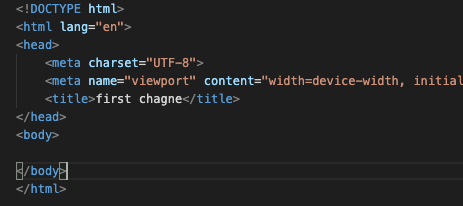
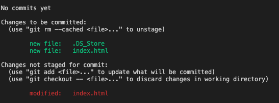
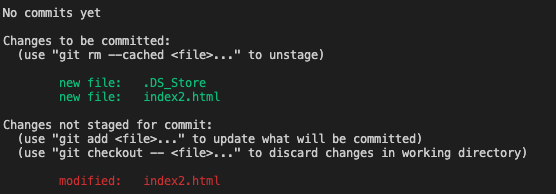

# git-learning
This doc is for tracking the testing that i have done to solidify my understanding with git and github.

## Git basic


#### git Init
The following command initialises a git repository
```bash

$ git init

# This message will show, once sucess "Initialized empty Git repository"
```

#### git add
The following command add changes to the staging.
```bash
# " . " means all changes, or a particular file
# Only added change would be placed into staging area
$ git add . 
$ git add <file> 
```

#### git commit
This command commit changes to the repository.
```bash
$ git commit -m "commit message"
```

#### .gitignore


This command creates a *.gitignore* file.
```bash
 $ touch .gitignore
```

## My thought when play around the git comman.

#### If there exisits git already, what happens if I `$ git init` agian ?
It's fine, it won't harm. The following command was run *after* i have already initilaised a git repository.
```bash
$ git init
# This message will show: "Reinitialized existing Git repository"
```
Check more about this on [stack overflow](https://stackoverflow.com/questions/5149694/does-running-git-init-twice-initialize-a-repository-or-reinitialize-an-existing) .

#### What happens if I add a change to the staging area where it already exits a previous change ?

To test this out, I made a first change on a file. Then I added it to the staging area


After that, I made a second change and added it again.


Looks like the new added change will overwrite the old change one for the same file.

#### What happens if I change file name when the change is already being staged ?

To test this out I first made a change.


Then if I run `$ git status`, I obtain the following:




Then I used command:
```bash
 $ git mv index.html index2.html 
 ```
 to change my index.html to index2.html. And this is what showed up when I use `$ git status`:




Looks like git can tell if the change comes from the same file that has just been renamed.

If I simply just rename it by `right clicking > rename`. It will appear to the git as `<old file>` has been deleted, a `<new file>` is then created.


#### What happens if I add file name on .gitignore after I add it change to the staging area ?

To test this out I simply created a *.gitignore* after I already have the *.DS_Store* file on the staging area.


Then If i check the status, I get the following:


Looks like it I will have to to remove it mannualy from the staging area, git will stop tracking change the moment after file name is written on .gitignore, not before.


## Github Basic
#### Remote

This command adds a remote repository named as origin. Origin as with master has no particular meaning according to [git docs](https://git-scm.com/docs/git-merge)

```bash
# To add a remote repository
git remote add origin git@github.com:jackytsheng/git-learning

```
Using this protocol requires entering of password each time `git push` and `git pull`. Whereas using the `https://` protocol doesn't

#### Push

This command push local repository to remote repository
```bash
# If push for the first time, setting up-stream is requried
$ git push -u origin master
$ git push

# This message will be obtained if there is no upstream branch "fatal: The current branch master has no upstream branch."
```
### Fetch and Pull


These two commands will help updating the local repository from the commits on github.

```bash
$ git fetch 
$ git pull

```
- `$ git pull` is `$ git fetch` then `$ git merge`.

- `$ git fetch` will add the remote master to a deteached Head branch. `$ git branch -a` can be use to see this

- `$ git status` can also shows a detached `HEAD` in red color text.


### Merge
This command merge remote repository to the locally repository. When merge conflicts may arise.

```bash
$ git merge
```

### Finding 

- It's a good habbit to `$ git pull` each time before start working locally when collaborating.

- Merge command is typed from the receving branch, *make sure to check using `$ git branch` and use `$ git checkout `to swap branches.

#### What happens if pushing local repository for the first time to remote repository that already exists commits.

To test this out, i create this README.md on the repository and edited there, where my index.html is edited locally. After `$ git push -u origin master`

Seems like a reject message will be obtained due to different history.


Same error shown message when `git pull`.


#### Resolving the previous problem

This [article from edpresson](https://www.educative.io/edpresso/the-fatal-refusing-to-merge-unrelated-histories-git-error) explain how to resolve this issue. Bascially  after allowing unrelated history merge, using `--allow-unrelated-histories`. and Problem resolved.

*But if this is the first time pushing onto the remote repository, setting upstream is still necessary, because last time git push failed*

#### Switch branch during editing,what happens ?

I add a line of text under a `feature branch`, then I added it to the staging area. A warning message will be obtained as following
```bash
Please commit your changes or stash them before you switch branches.
Aborting
```

#### little finding:
- During the time which feature branch has evolved, if the master branch has no change then on git history extension, it will be shown as a single line instead of two seperate line.

- After merging back to master, all commit message will be shown linearly


#### Resolve conflict

To evoke conflicts, I first create a testing file on a master branch `$ touch testing.txt`

and made two commits with commit message "m1" , "m2".

Then `git checkout feature` , and made 2 more commits with commit  message "f1" ,"f2". After that, `git checkout master` and made a third commit "m3".

---

First way to resolve this conflict: merge master onto feature branch, then merge back in master.


In this method, I first `git merge master`, edit the change I want, make a final commit. Then I `git merge feature`, then fast-forward merge occurs.

If I were to check out the history `$ git log`

- I would have got the commit history in this order "m1" , "m2" , "f1" , "f2" , "m3" , "merge message" .

---


Second way to resolve this: use `$ git rebase master` on feature branch


In this method I `git rebase master` edit the change I want, and use `$ git rebase --continue` or if to abort the rebase using `$ git rebase --abort`. Upon success a message of 
```
Applying: <your commit message> 
```
will be shown. It is assuming all changes from master were applied in f1. Then I checkout to master and `$ git rebase feature`.or `$ git merge feature`

- I would have got the commit history in this order "m1" , "m2" , "m3", "f1" , "f2" .


